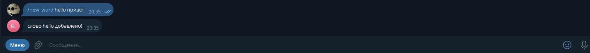
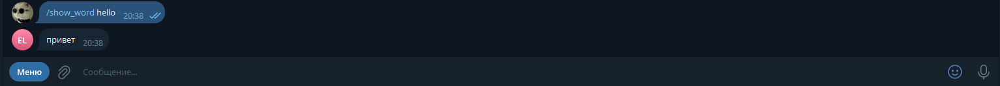
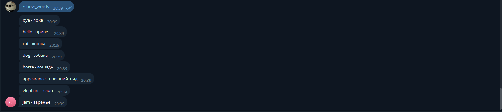
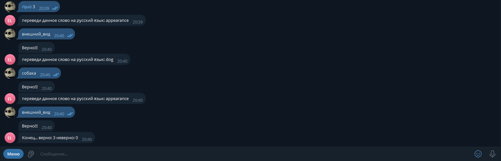
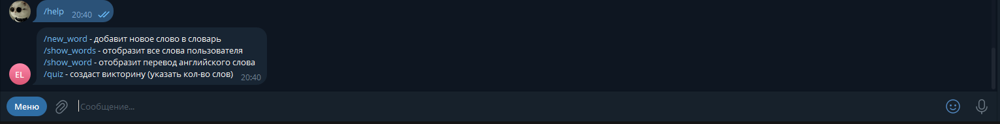

# Бот для изучения английского языка

## Описание
Учебный бот, позволяющий следить за прогрессом изучения английских слов и помогающий запоминать данные слова.
## Что может бот?
- /new_word - добовляет новое слово в словарь.
- /show_words - отобразит все слова пользователя.
- /show_word - отобразит перевод указанного английского слова.
- /quiz - создаст викторину.
- /help - покажет все команды, которые может обработать бот.
## Чему я научился во время составления проекта:
- Понятие чат-ботов, регистрация тг-бота, библиотека pyTelegramBotAPI
- Стандартная структура программы для управления ботом.
- Обработка команд с помощью встроенных декораторов.
- Обработка любых сообщений от пользователя.
- Постоянное хранение данных в JSON-файлах.
- Обработка ответов отдельным сообщением.
- Раздельное хранение слов многих пользователей
## Работа бота

### /new_word:

### /show_word:

### /show_words:

### /quiz

### /help
